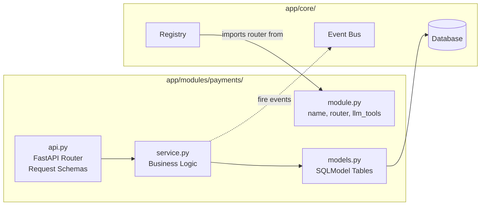
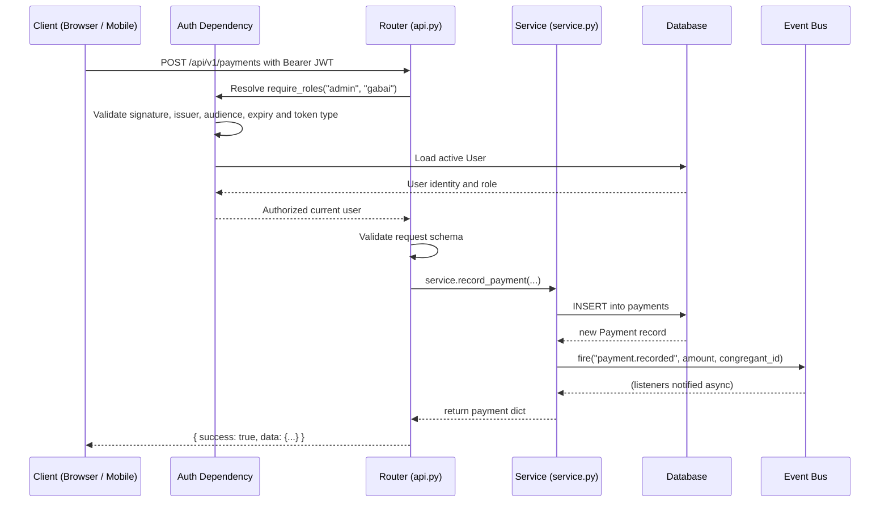
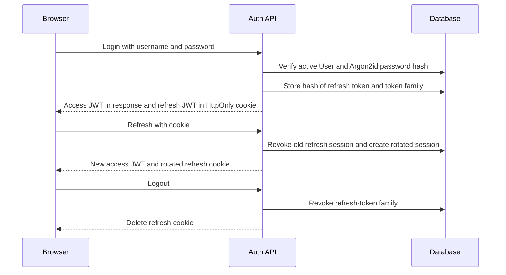
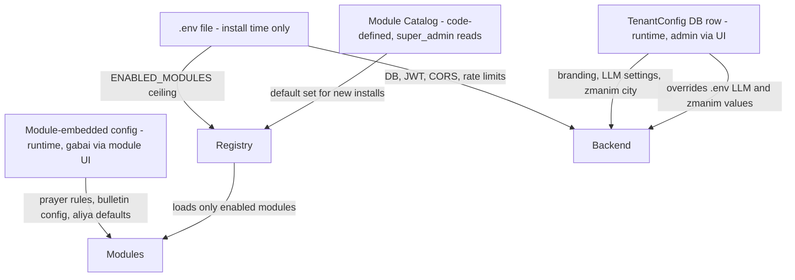
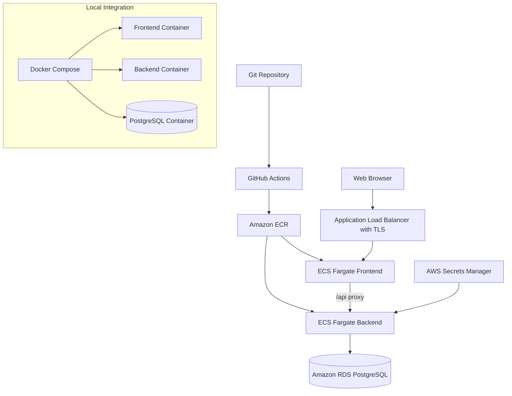
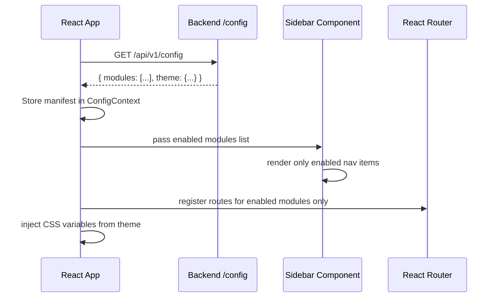
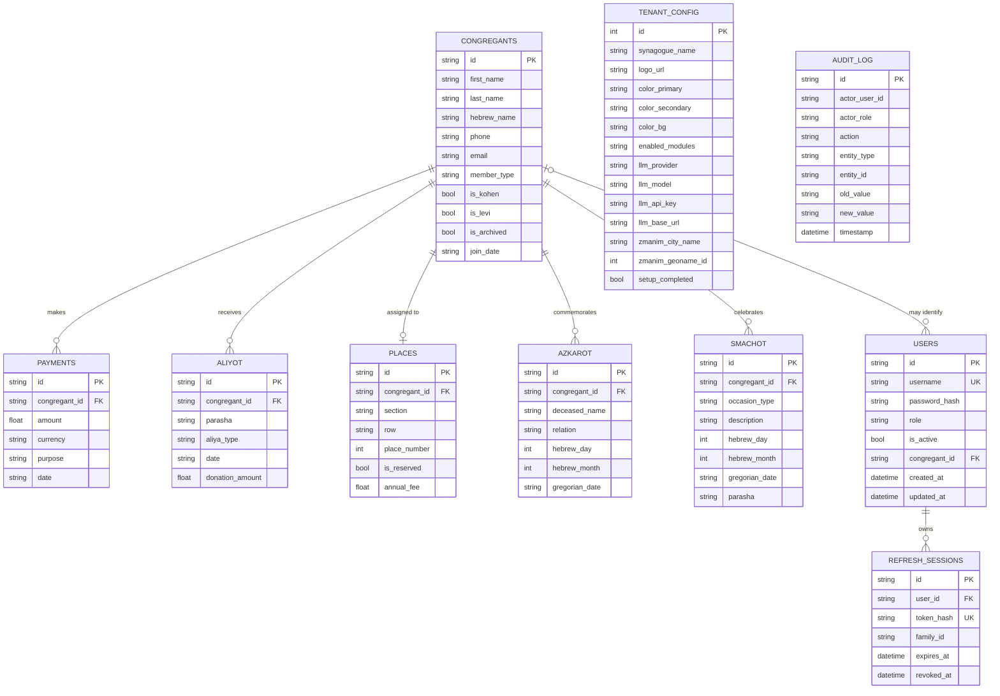

# Gabay Architecture Guide

This document describes the modular architecture of the Gabay Synagogue Management System.

---

## 1. Full System Overview

The entire platform — web, mobile, backend, AI, and support panel — in one diagram.

```mermaid
graph TD
    subgraph Clients [Clients]
        Browser[Web Browser - React SPA]
        Platform[Platform Panel - super_admin only]
        Mobile[Mobile App - React Native - Future]
    end

    subgraph Backend [Backend - FastAPI - Python]
        Main[main.py]
        Registry[Module Registry]
        ModCatalog[Module Catalog]
        Bus[Event Bus]

        subgraph Core [Core - app/core/]
            DB[(SQLite / PostgreSQL)]
            AuthCore[JWT Validation and Auth Dependencies]
            TenantCfg[Tenant Config - settings + LLM + zmanim]
            HebDate[Hebrew Date - pyluach]
            AuditLog[Audit Log]
        end

        subgraph Modules [Pluggable Modules - app/modules/]
            MOD_C[congregants]
            MOD_P[payments]
            MOD_A[aliyot]
            MOD_S[seating]
            MOD_CAL[calendar]
            MOD_LLM[llm - Digital Gabbai]
            MOD_AUTH[auth - Users and Sessions]
            MOD_PS[prayer_schedule]
            MOD_BUL[bulletin]
            MOD_WA[whatsapp - v3.5]
        end

        Main --> Registry
        Registry -->|loads enabled modules| Modules
        Modules --> DB
        MOD_AUTH --> AuthCore
        AuthCore --> DB
        Modules -.->|fire| Bus
        Bus -.->|notify| Modules
        TenantCfg -.->|LLM config override| MOD_LLM
        TenantCfg -.->|zmanim config override| MOD_CAL
    end

    subgraph External [External Services]
        OpenAI[OpenAI / Azure / Ollama]
        WhatsAppAPI[WhatsApp Business API]
        HebCal[Hebcal API - zmanim]
        FCM[Firebase - Push]
    end

    Browser -->|Bearer access JWT and refresh cookie| Backend
    Platform -->|super_admin JWT - /platform routes| Backend
    Mobile -->|REST /api/v1| Backend
    TenantCfg -->|JSON Manifest - branding + active modules| Browser
    MOD_LLM --> OpenAI
    MOD_WA --> WhatsAppAPI
    MOD_CAL --> HebCal
    FCM --> Mobile
    ModCatalog -->|default module set for new installs| Registry
```



---

## 2. Module Internal Structure

Every module follows the same internal layout. No module may import from another module.



**Isolation Rules:**
- `api.py` → calls `service.py` only, never DB directly
- `service.py` → owns its `models.py`, fires events on the Bus
- Cross-module references are **soft** (plain string ID, no DB foreign key)
- Authentication is the explicit exception: `User.congregant_id` declares an optional foreign key for a future web account linked to a congregant. WhatsApp identification does not require a `User`.

**Entities and roles are different concepts:**
- Entities such as `User`, `Congregant`, and `TenantConfig` are persisted business or technical records.
- A role is a permission label attached to an authenticated actor; it is not a business entity.
- `TenantConfig` is the technical model presented in the product as **Synagogue settings**. Reading the public branding manifest is allowed before login; changing synagogue settings is an Admin-only operation.

---

## 3. Protected Request Lifecycle

Authentication uses explicit FastAPI dependencies rather than blanket JWT middleware. Every domain router now requires an operational `admin` or `gabai` actor, protected settings require `admin`, and sensitive service/LLM entry points re-check authorization.



Router dependencies establish the permitted role and return `401` or `403`. Services must independently enforce protected-operation and row-level rules because the same service can be reached from REST, the LLM, or WhatsApp. Frontend route visibility and prompt instructions are usability controls, not security boundaries.

---

## 4. Authentication and Session Lifecycle

The backend authentication contract is implemented in `app/modules/auth/`. The frontend login and in-memory access-token lifecycle are added in a later phase. The backend implements all three approved roles below.

**Public endpoint contract:**
- `GET /health`
- `GET /api/v1/config` for pre-login branding
- `POST /api/v1/auth/register` only while no users exist
- `POST /api/v1/auth/login`
- `POST /api/v1/auth/refresh`
- `POST /api/v1/auth/logout`

After bootstrap, `/auth/register` requires an authenticated administrator. `PATCH /api/v1/config` also requires Admin, while `GET /api/v1/config` remains public for pre-login branding. All management routers require an authenticated Admin or Gabai, and sensitive services repeat authorization checks below the router layer.

**Four-tier role hierarchy:**

```
super_admin  → Gabay product team. /platform panel only. Cross-installation visibility.
admin        → Synagogue administrator. /settings page. One per synagogue.
gabai        → Day-to-day operator. Operational pages only. 1–3 per synagogue.
congregant   → WhatsApp self-service only (v3.5). No web UI.
```

- `super_admin`: platform-level role for the Gabay product team. Accesses `/platform` (tenant list, remote config, module catalog, audit log). Not visible in the per-synagogue sidebar. Added in v2.5.
- `admin`: synagogue-level administrator. Accesses `/settings` (profile, LLM, location, users). Manages gabai users. Has full operational access in addition to admin access.
- `gabai`: full operational access to all modules. Cannot access `/settings` or manage users.
- `congregant`: WhatsApp-only. No web login required. Verified phone → `Congregant` → server-enforced `congregant_id`.

**Authorization principals:**
- `super_admin`, `admin`, and `gabai` use web authentication: credentials resolve to an active `User`, JWT claims identify the user and role, router plus service rules authorize the operation.
- A WhatsApp congregant does not register or log in. A verified sender phone is matched to `Congregant.phone`; the server constructs a `congregant` principal with that record's `congregant_id`.
- `User.congregant_id` remains optional and supports future account linkage if a congregant portal is introduced. It is not required for WhatsApp self-service.



Only hashes of refresh tokens are persisted. Reuse of a revoked refresh token revokes its complete token family.

### Scope and abuse protection

`AuthScope` is the channel-independent authorization principal. Web requests construct it from the active JWT user, while the future WhatsApp adapter will construct a congregant scope after verified phone resolution. Personal-data services enforce the effective `congregant_id` in their database queries; LLM prompts are not treated as an authorization boundary.

LLM tools are selected by scope and checked again during dispatch. Admin and Gabai receive operational tools, while congregant scopes receive public date tools and read-only `my_*` tools bound to the authenticated congregant ID. Sensitive self-service writes remain deferred to the approval and audit workflow.

Failed login, refresh, and LLM chat requests have independent limits and return the shared API envelope with `429` and `Retry-After`. Development and tests use an in-memory backend. Multi-instance production must set `RATE_LIMIT_BACKEND=redis` and configure a shared Redis/Valkey endpoint so counters are atomic across workers and ECS tasks.

### WhatsApp congregant scope

The WhatsApp webhook must verify the provider signature and sender number before identity resolution. Unknown or ambiguous numbers receive no private data. For a verified match, every personal query is filtered by `congregant_id` in the service/database layer, and the LLM receives only public tools plus explicit `my_*` tools.

Public reads and safe self-updates may complete immediately. Sensitive changes—identity details, financial records, yahrzeits, seating, or permissions—create a request for Gabai approval. Identity resolution, selected tool, effective scope, requested change, approval, and outcome are audit logged.

---

## 5. Settings & Configuration Architecture

Configuration is split across three tiers. Never mix them.



**Tier 1 — `.env` (install time, no UI ever)**
- `DATABASE_URL`, `JWT_SECRET`, `CORS_ORIGINS`, `ENVIRONMENT`, `DEBUG`, rate limits
- `ENABLED_MODULES` — the ceiling of what this installation can load. Adding a module = a deployment procedure.

**Tier 2 — `TenantConfig` DB row (Settings page, admin only)**
- Branding: `synagogue_name`, `logo_url`, `color_primary`, `color_secondary`, `color_bg`
- LLM: `llm_provider`, `llm_model`, `llm_api_key` (encrypted), `llm_base_url` — read first; `.env` is fallback
- Location: `zmanim_city_name`, `zmanim_geoname_id` — read first; `.env` is fallback
- `setup_completed` — tracks first-run onboarding completion

**Tier 3 — Module-embedded config (inside each module, gabai-accessible)**
- Prayer schedule rules, bulletin config, aliya pricing, seating sections
- Never belongs in global Settings

**Module Catalog (code-defined, super_admin-visible at `/platform/modules`)**
- Authoritative list of all modules with `tier` (`base` / `addon` / `enterprise`) and `enabled_by_default`
- Not DB rows — defined in code, exposed via API
- Evolves into the license entitlement system in v4.0

---

## 6. Event Bus (Hook System)

Modules communicate only through events. No direct imports between modules.

```mermaid
sequenceDiagram
    participant CongSvc as Congregants Service
    participant Bus as Event Bus
    participant PaySvc as Payments Service
    participant SeatSvc as Seating Service
    participant WASvc as WhatsApp Service

    CongSvc->>Bus: fire("congregant.archived", id=...)
    Bus->>PaySvc: on_congregant_archived()
    Bus->>SeatSvc: on_congregant_archived() - free seat
    Bus->>WASvc: on_congregant_archived() - notify
    Note over CongSvc: Does not know about
Payments, Seating, or WhatsApp
```

**Core Events Table:**

| Event | Fired By | Example Listeners |
|---|---|---|
| `congregant.created` | congregants | payments (create dues invoice) |
| `congregant.archived` | congregants | seating (free up seat), whatsapp |
| `payment.recorded` | payments | llm (update summary context) |
| `aliya.assigned` | aliyot | payments (auto-record donation) |
| `azkara.approaching` | calendar | whatsapp (D-7 and D-1 reminders) |
| `bulletin.building` | bulletin | all modules (inject weekly content) |

---

## 7. Deployment Architecture

The v3.0 target is a single-tenant deployment on AWS ECS Fargate. Each synagogue is a separate installation with its own database; multi-tenancy (shared DB with `tenant_id` isolation) is a v4.0 concern. Kubernetes is intentionally not required for v3.0.

The support platform (`/platform`, v3.2) runs as part of the same backend but is only accessible via `super_admin` JWT. It does not require a separate deployment.



**How the Registry uses `ENABLED_MODULES`:**
1. `main.py` imports every `app/modules/<name>/module.py` at startup
2. Each `module.py` calls `registry.register(ModuleDefinition(...))` — self-registration
3. `main.py` then calls `registry.get_enabled(settings.ENABLED_MODULES)`
4. If enabled: the module's router is mounted under `/api/v1`
5. If disabled: the module is completely skipped — no routes, no AI tools

---

## 8. Frontend Dynamic Loading



---

## 9. Database Entity Relationship

Domain entities are linked to `Congregant` through **soft string IDs**. Authentication is the deliberate exception: optional `User.congregant_id` declares a cross-module foreign key for future web-account identity scope. WhatsApp scope is resolved directly from a verified `Congregant.phone`.



---

## 10. Key Design Decisions

| Decision | Reason |
|---|---|
| Modular Monolith over Microservices | Lower operational complexity. Can migrate to microservices later if needed. |
| Soft IDs for domain modules | Allows modules to be removed or added without cascade errors; authentication identity scope is the documented exception. |
| Event Bus over direct imports | Zero coupling — adding a WhatsApp module does not touch the Congregants module. |
| FastAPI authorization dependencies | Keeps the public allowlist explicit and role requirements visible at router level. |
| Defense-in-depth authorization | Router, service, and database layers enforce roles and row scope; UI visibility, WhatsApp orchestration, and LLM prompts never authorize access. |
| Four-tier role hierarchy | `super_admin` (product team) / `admin` (synagogue) / `gabai` (operations) / `congregant` (WhatsApp). Each tier has clearly bounded access that does not overlap. |
| Admin-only Settings page | `TenantConfig` controls branding, LLM config, and location; only `admin` may mutate it. `super_admin` can access all tenants via `/platform`. |
| LLM and zmanim config in TenantConfig | Rotating an API key or changing the prayer-time city should not require a server restart. `TenantConfig` overrides `.env`; `.env` is the fallback for backward compatibility. |
| ENABLED_MODULES in .env only | Module availability is an install-time (product/licensing) decision, not a runtime toggle. The Module Catalog in code defines which modules belong to which tier; the v4.0 License model formalizes billing entitlement. |
| Module Catalog in code, not DB | The catalog is product-defined, not user-defined. `super_admin` can read and set defaults; creating new module entries requires a code deployment. |
| Separate Support Platform panel | The Gabay product team needs visibility across all synagogue installations without SSH access. `/platform` is accessible only to `super_admin` and is completely separate from the per-synagogue UI. |
| Phone-scoped WhatsApp identity | Verified phone → `Congregant` → server-enforced `congregant_id`, without requiring registration or a `User`. |
| Rotated refresh sessions | Supports real logout, server-side revocation, and refresh-token reuse detection. |
| AWS ECS Fargate for v3.0 | Most common cloud ecosystem with managed containers and no Kubernetes operational burden. |
| Separate frontend and backend images | Supports nginx static delivery while keeping the FastAPI runtime independently deployable. |
| Dynamic LLM tools | Disabled modules are completely invisible to the AI assistant. |
| React Native for Mobile | Reuses 90% of existing API layer; single codebase for Android and iOS. |
