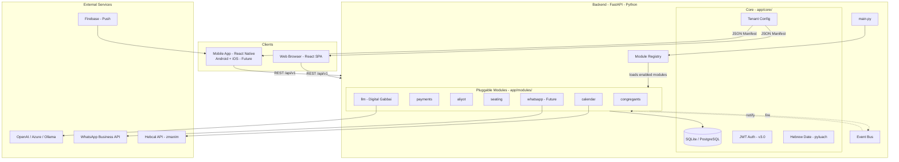
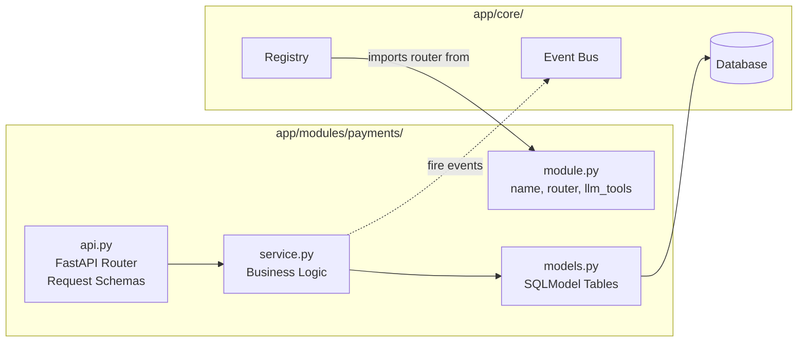
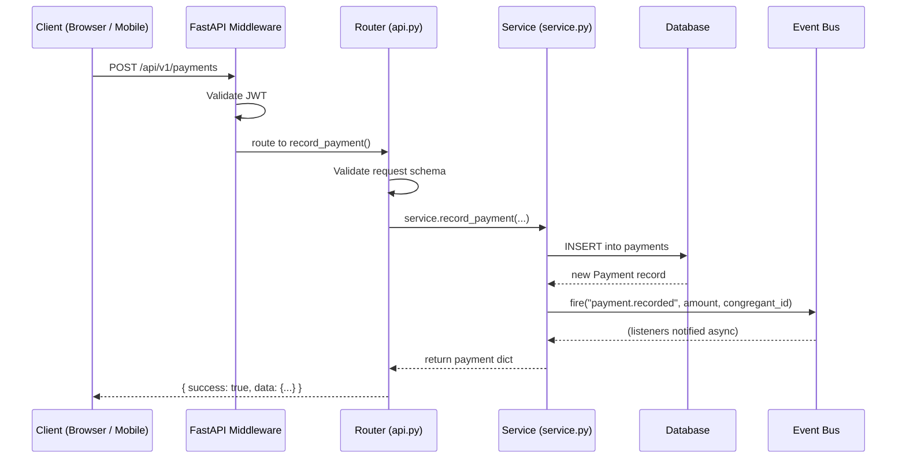
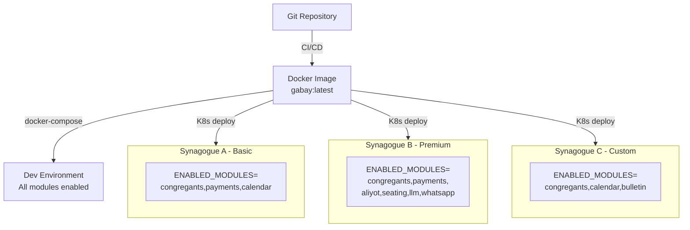
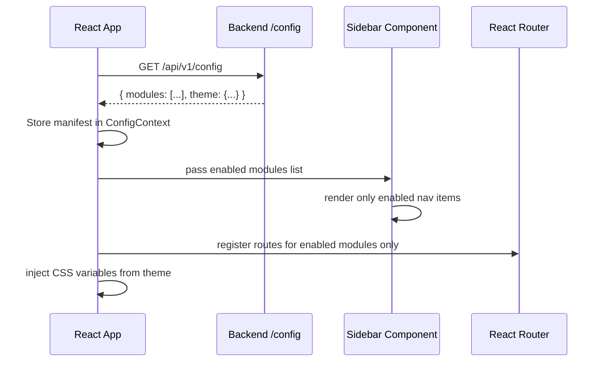
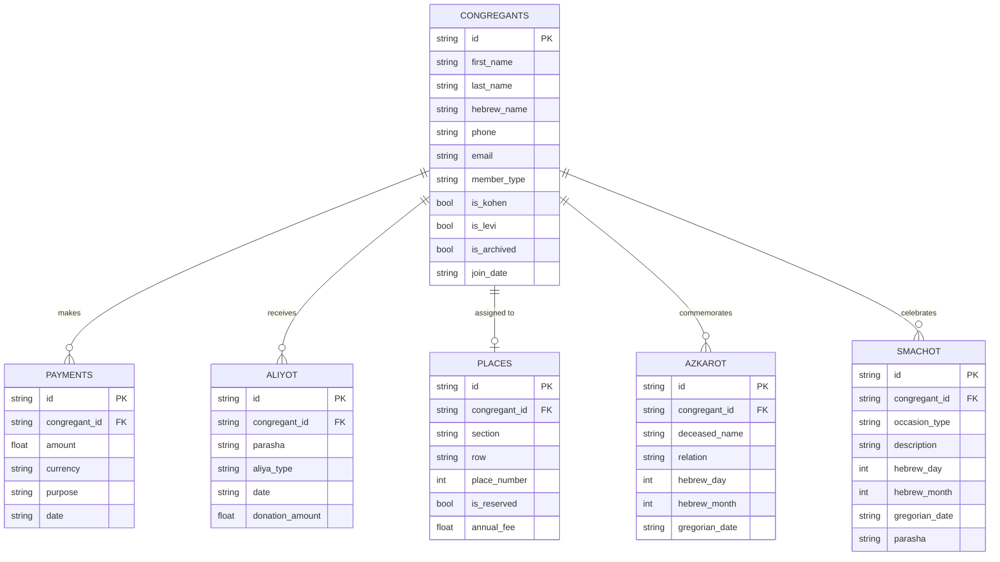

# Gabay Architecture Guide

This document describes the modular architecture of the Gabay Synagogue Management System.

---

## 1. Full System Overview

The entire platform — web, mobile, backend, and AI — in one diagram.



---

## 2. Module Internal Structure

Every module follows the same internal layout. No module may import from another module.



**Isolation Rules:**
- `api.py` → calls `service.py` only, never DB directly
- `service.py` → owns its `models.py`, fires events on the Bus
- Cross-module references are **soft** (plain string ID, no DB foreign key)

---

## 3. Request Lifecycle

How a single API call flows through the system.



---

## 4. Event Bus (Hook System)

Modules communicate only through events. No direct imports between modules.

```mermaid
sequenceDiagram
    participant CongSvc as Congregants Service
    participant Bus as Event Bus
    participant PaySvc as Payments Service
    participant SeatSvc as Seating Service
    participant WASvc as WhatsApp Service

    CongSvc->>Bus: fire("congregant.archived", id=...)
    Bus->>PaySvc: on_congregant_archived()
    Bus->>SeatSvc: on_congregant_archived() - free seat
    Bus->>WASvc: on_congregant_archived() - notify
    Note over CongSvc: Does not know about
Payments, Seating, or WhatsApp
```

**Core Events Table:**

| Event | Fired By | Example Listeners |
|---|---|---|
| `congregant.created` | congregants | payments (create dues invoice) |
| `congregant.archived` | congregants | seating (free up seat), whatsapp |
| `payment.recorded` | payments | llm (update summary context) |
| `aliya.assigned` | aliyot | payments (auto-record donation) |
| `azkara.approaching` | calendar | whatsapp (D-7 and D-1 reminders) |
| `bulletin.building` | bulletin | all modules (inject weekly content) |

---

## 5. Deployment Architecture

One Docker image, many synagogues — each with its own enabled modules and branding.



**How the Registry uses `ENABLED_MODULES`:**
1. `main.py` imports every `app/modules/<name>/module.py` at startup
2. Each `module.py` calls `registry.register(ModuleDefinition(...))` — self-registration
3. `main.py` then calls `registry.get_enabled(settings.ENABLED_MODULES)`
4. If enabled: the module's router is mounted under `/api/v1`
5. If disabled: the module is completely skipped — no routes, no AI tools

---

## 6. Frontend Dynamic Loading



---

## 7. Database Entity Relationship

All entities are linked to `Congregant` through a **soft ID** (string UUID). There are no cross-module foreign keys.



---

## 8. Key Design Decisions

| Decision | Reason |
|---|---|
| Modular Monolith over Microservices | Lower operational complexity. Can migrate to microservices later if needed. |
| Soft IDs over DB Foreign Keys | Allows modules to be removed or added without DB migrations or cascade errors. |
| Event Bus over direct imports | Zero coupling — adding a WhatsApp module does not touch the Congregants module. |
| Single Docker image + ENV toggle | Simple CI/CD pipeline; monetization is config, not separate builds. |
| Dynamic LLM tools | Disabled modules are completely invisible to the AI assistant. |
| React Native for Mobile | Reuses 90% of existing API layer; single codebase for Android and iOS. |
