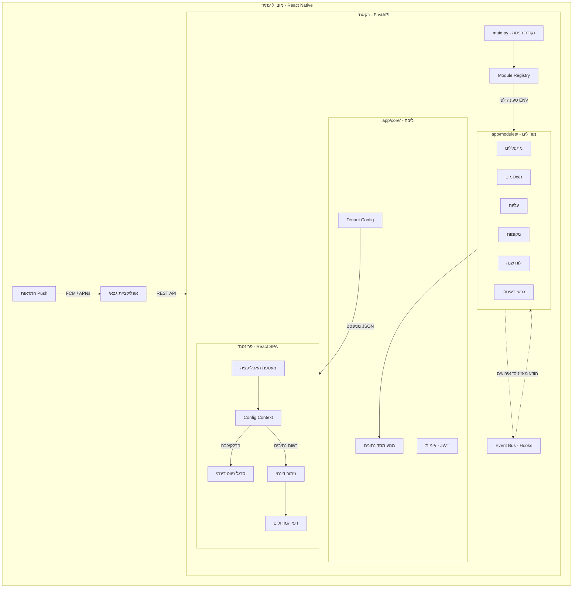

# אפיון מוצר – גבאי (Gabay)

## 1. סקירה כללית

**גבאי** הוא מערכת ניהול בית כנסת המיועדת לגבאים ומנהלי קהילות. המערכת מאפשרת ניהול מתפללים, תשלומים, עליות לתורה, מקומות ישיבה, אזכרות ושמחות – הכול ממשק אחד, בעברית, עם תמיכה מלאה בלוח השנה העברי.  
ממשק הצ'אט המובנה, המופעל על ידי LLM, מאפשר לגבאי לבצע כל פעולה בשפה טבעית ללא צורך בניווט בתפריטים.

---

## 2. קהל יעד

### משתמש עיקרי – הגבאי
- מנהל יומיומי של בית הכנסת: גבאי ראשי או סגנו
- בדרך כלל בעל ידע טכנולוגי בסיסי עד בינוני
- עובד בעברית; מכיר היטב את לוח השנה העברי ומינוחי בית כנסת
- זקוק למידע מהיר בזמן תפילה (מי נכח, מי מקבל עלייה, מי ביום יארצייט)

### משתמשים משניים
- **מנהל כספים קהילתי** – מעקב תשלומים ותרומות
- **רב / חזן** – בדיקת עליות לתורה ואזכרות לפרשת השבוע

---

## 3. בעיה שהמוצר פותר

גבאים מנהלים כיום את פרטי הקהילה בגיליונות אקסל, פנקסים ידניים, או מספר קבצים מקבילים. הדבר מוביל ל:
- מידע מפוצל ולא מעודכן
- קושי בחיפוש מהיר במהלך תפילה
- אין תזכורות אוטומטיות לאזכרות ושמחות
- חישובי תאריכים עבריים ידניים ומועדים לטעויות

---

## 4. פיצ'רים – MVP

### 4.1 ניהול מתפללים

**תיאור:** ספר הקהילה המרכזי.

**יכולות:**
- הוספה, עריכה ומחיקה (רכה – ארכיון) של מתפלל
- שדות: שם, שם בעברית, שם האב, שם האם, טלפון, מייל, כתובת, מין, סוג חברות (קבוע / אורח / מזדמן), מעמד (כהן / לוי / ישראל)
- חיפוש טקסטואלי בשם
- ייבוא מרובה מקובץ CSV או Google Sheets (כולל תמיכה בכותרות עבריות)
- ארכוב / שחזור מתפלל מבלי למחוק את ההיסטוריה

**כללים עסקיים:**
- מתפלל מארכב אינו מוצג בחיפוש רגיל אך היסטוריית הפעילות שלו נשמרת
- ייבוא CSV ממפה עמודות לפי שם (גמיש לסדר)

---

### 4.2 לוח שנה עברי

**תיאור:** תצוגת חודש המשלבת תאריכים גרגוריאניים ועבריים עם אירועים קהילתיים.

**יכולות:**
- תצוגת חודש מלאה עם שני לוחות: גרגוריאני ועברי
- הדגשת שבתות וחגים
- המרה דו-כיוונית בין תאריכים (גרגוריאני ↔ עברי)
- חישוב "מועד הבא" לתאריך עברי נתון (לצורך אזכרות ושמחות)
- תצוגת אירועי הקהילה בלוח: אזכרות ושמחות המתוכננות לאותו חודש

**פרטי יישום:**
- ממומש עם ספריית `pyluach` בצד השרת
- תגובות API כוללות פרטי חג ושבת לכל יום

---

### 4.3 תשלומים

**תיאור:** מעקב אחר תשלומי חברות ותרומות.

**יכולות:**
- רישום תשלום לכל מתפלל: סכום, מטבע, מטרה, תאריך, הערות
- היסטוריית תשלומים למתפלל
- רשימת "ממתינים לתשלום" – מתפללים שטרם שילמו לפי מטרה
- מחיקה מרובה

---

### 4.4 עליות לתורה (עלייות)

**תיאור:** ניהול חלוקת עליות לפרשות.

**יכולות:**
- שיוך עלייה למתפלל: פרשה, סוג עלייה (ראשון / שני / ... / מפטיר), תאריך, מנהג, תרומה, הערות
- תצוגת עליות לפי פרשה
- היסטוריית עליות למתפלל
- מחיקה מרובה

---

### 4.5 מקומות ישיבה

**תיאור:** מפת מקומות בבית הכנסת.

**יכולות:**
- הגדרת מקום: מקטע, שורה, מספר מקום, דמי שנתי, מוגדר/חופשי
- שיוך / ביטול שיוך מקום למתפלל
- סינון מקומות פנויים / תפוסים / לפי מקטע
- שאילתת "מהו מקומו של מתפלל X"

---

### 4.6 אזכרות (יארצייט)

**תיאור:** ניהול תאריכי יארצייט לבני משפחה של מתפללים.

**יכולות:**
- הוספת אזכרה: שם הנפטר, קשר משפחתי, תאריך עברי + גרגוריאני, שנת הפטירה, הערות
- רשימת אזכרות קרובות (X ימים הבאים)
- סינון לפי מתפלל

---

### 4.7 שמחות

**תיאור:** ניהול אירועי שמחה קהילתיים.

**יכולות:**
- הוספת שמחה: סוג (יום הולדת / בר מצווה / בת מצווה / יובל / ברית / חתונה / אחר), תיאור, תאריך עברי + גרגוריאני, פרשה, שנת האירוע, הערות
- רשימת שמחות קרובות (X ימים הבאים)
- סינון לפי מתפלל / סוג

---

### 4.8 ממשק LLM בעברית (הגבאי הדיגיטלי)

**תיאור:** צ'אט בעברית שמאפשר לגבאי לבצע כל פעולה בשפה טבעית.

**יכולות:**
- שאלות ותשובות: "מי קיבל עלייה ראשונה בפרשת בראשית?", "מה היתרה של אברהם כהן?"
- ביצוע פעולות: "הוסף תשלום של 500 ש"ח מדוד לוי עבור חברות", "שייך את מקום א-3 לשמעון ישראל"
- תזכורות: "מי יש לו יארצייט השבוע?"
- מנגנון: LLM מקבל prompt בעברית + רשימת כלים (JSON Schema); בוחר כלי רלוונטי → קריאה לשירות → תשובה בעברית

**כלי LLM (tools) זמינים:**
| קטגוריה | כלים |
|---|---|
| מתפללים | חיפוש, הוספה, עדכון, ארכוב |
| תשלומים | רישום, בדיקת היסטוריה, רשימת ממתינים |
| עליות | שיוך עלייה, היסטוריה לפי מתפלל / פרשה |
| מקומות | שאילתה, שיוך, ביטול שיוך |
| אזכרות | הוספה, רשימה קרובה |
| שמחות | הוספה, רשימה קרובה |
| לוח שנה | המרת תאריכים, תצוגת חודש |

**תנאי כשל:** כאשר ה-LLM לא מצליח לזהות כלי מתאים – מחזיר הסבר בעברית ומבקש פרטים נוספים.

---

## 5. פיצ'רים עתידיים (Post-MVP)

### 5.1 לוח זמני תפילות (v2.1)
- **מנוע כללים:** במקום שעה קבועה, הגבאי מגדיר "מנחה = 15 דקות לפני שקיעה"; המערכת מחשבת אוטומטית
- **לוח שבועי מחושב:** תצוגת ימי החול ושבת עם שעות בפועל לצד הכלל
- **אינטגרציה:** כרטיס "זמני היום" ב-Dashboard וכלי LLM `get_prayer_times(date)`

### 5.2 תקשורת ולוח שבועי (v2.2)
- **מרכז תקשורת:** כפתור "שלח בוואטסאפ" ליד אזכרות ושמחות; תזכורות אוטומטיות במייל (SMTP)
- **לוח שבועי דינמי (v2.2):** מחולל אוטומטי של הודעת שבת לוואטסאפ, HTML למייל, והדפסה A4
- **לוח שבועי מעוצב (v3.6):** מנוע Canva-style עם Auto-Scaling לדף A4, ערכות נושא, ייצוא PDF/תמונה

### 5.3 פיננסים ודוחות (v2.3)
- **התחייבות vs שולם:** ניהול סטטוס תשלום בכל רשומת תרומה
- **קבלות PDF:** הפקת קבלות מעוצבות עם לוגו בית הכנסת
- **ניהול פיננסי מורחב (v2.3):** תיעוד הוצאות והכנסות שאינן תרומות (השכרת אולם, מענקים)
- **דוח שנתי:** ייצוא P&L (הכנסות מול הוצאות) לוועד בית הכנסת

### 5.4 בינה מלאכותית מתקדמת (v2.4)
- **LLM 2.0:** תמיכה ב-RAG על מסמכי PDF (תקנון, נהלים, הלכות), שאילתות מורכבות
- **שיבוץ עליות חכם:** הצעת שיבוצים אוטומטית בהתבסס על תדירות, יארצייט וסטטוס כהן/לוי/ישראל
- **ניהול מלאי:** ניהול ספרים, ציוד וכלי קודש

### 5.5 בוט וואטסאפ קהילתי (v3.5)
> **תלוי ב-v3.0** – נדרש JWT Auth ומודל LLM Scope לפני פיתוח הבוט.
- **ממשק מתפלל:** שירות עצמי 24/7 למתפלל דרך וואטסאפ (ללא הרשמה, ללא אפליקציה)
- **זיהוי לפי טלפון:** המתפלל מזוהה לפי מספרו; LLM מוגבל רואה רק את הנתונים האישיים שלו
- **Broadcast:** שליחת עדכונים לכלל הקהילה מממשק הגבאי

### 5.6 ארכיטקטורת פלטפורמה (v4.0)
- **Module Registry:** הדלקה/כיבוי מודולים לפי צרכי בית הכנסת (`.env`)
- **Hook System:** נקודות הזרקת לוגיקה מותאמת ללא שינוי ה-Core
- **Tenant Config:** עיצוב דינמי (צבעים, לוגו) לפי בית כנסת
- **Multi-tenancy:** הפרדת נתונים לצורך SaaS עם ריבוי בתי כנסת

### 5.7 אפליקציית מובייל – Android ו-iOS (v5.0)

**חזון:** הגבאי מנהל את הקהילה מכף ידו – בכל מקום ובכל זמן, כולל תוך כדי תפילה.

**גישה מומלצת – React Native:**
- שימוש חוזר ב-90% מהלוגיקה ומשכבת ה-API הקיימת
- קוד בסיס אחד לשתי פלטפורמות (Android + iOS)
- ממשק RTL עברי מלא, כולל תמיכה בלוח השנה העברי

**יכולות מרכזיות לאפליקציה:**
- לוח מחוון (Dashboard) עם סטטיסטיקות קהילתיות
- חיפוש מהיר של מתפלל ועיון בפרופיל
- רישום תשלום ועלייה בלחיצה אחת
- התראות Push לאזכרות ושמחות קרובות (D-7, D-1)
- גישה לצ'אט עם הגבאי הדיגיטלי (LLM)
- מצב offline בסיסי – קריאה ממטמון מקומי כשאין חיבור

**שלבי יישום:**
1. **Phase 1 (MVP Mobile):** Dashboard, חיפוש מתפלל, רישום תשלום, התראות Push
2. **Phase 2:** צ'אט LLM, עליות, אזכרות, לוח שנה
3. **Phase 3:** מצב offline מלא, ביומטריה (Face ID / Fingerprint)

| פיצ'ר | גרסה |
|---|---|
| לוח זמני תפילות (מבוסס כללים) | v2.1 |
| תקשורת + לוח שבועי (טקסט) | v2.2 |
| פיננסים מלא + דוחות שנתיים | v2.3 |
| שיבוץ עליות חכם + מלאי + LLM 2.0 | v2.4 |
| ניהול משתמשים / אימות (JWT) + פריסה | v3.0 |
| בוט וואטסאפ קהילתי *(תלוי ב-v3.0)* | v3.5 |
| לוח שבועי מעוצב (Canva-style) | v3.6 |
| ארכיטקטורת פלטפורמה (SaaS) | v4.0 |
| בדיקות E2E (Playwright) + אפליקציית מובייל | v5.0 |

---

## 6. ארכיטקטורה טכנית (סיכום)

### 6.1 עקרונות פלטפורמה מודולרית

המערכת בנויה על עקרון ה-**Modular Monolith** – קוד אחד, מודולים עצמאיים. כל פיצ'ר הוא מודול בפני עצמו שניתן להדליק ולכבות לפי צרכי בית הכנסת.

| עיקרון | תיאור |
|---|---|
| **ארכיטקטורה מודולרית** | כל פיצ'ר ב-`app/modules/` – ניתן להוספה/הסרה ללא שינוי ה-Core. |
| **גילוי דינמי** | `ModuleRegistry` טוען ראוטרים וכלי LLM לפי משתנה `ENABLED_MODULES`. |
| **תקשורת מבוססת אירועים** | מודולים מתקשרים דרך Hook System – אפס תלות ישירה. |
| **Soft Relationships** | הפניות בין מודולים ב-DB הן מחרוזת ID בלבד, ללא Foreign Key קשיח. |
| **מניפסט לפרונטנד** | Endpoint `GET /config` מחזיר מודולים פעילים + מיתוג לבית כנסת ספציפי. |

### 6.2 טבלת טכנולוגיות

| שכבה | טכנולוגיה |
|---|---|
| Backend | Python 3.11+, FastAPI, Uvicorn |
| ORM / DB | SQLModel + SQLite (ניתן להחלפה ל-PostgreSQL) |
| לוח שנה עברי | pyluach |
| LLM | OpenAI API (גמיש: Azure / Ollama) |
| Frontend (Web) | React 19, TypeScript, Vite, Tailwind CSS |
| Mobile (עתידי) | React Native + Expo |
| State management | TanStack Query (React Query) |
| Routing | React Router 7 (Web) / React Navigation (Mobile) |

**תקשורת:** REST API תחת `/api/v1/`. כל תגובה עטופה ב-`{ success, message, data }`.  
**Dev proxy:** Vite מפנה `/api` → `http://localhost:8080`.

---

## 7. מדדי הצלחה (MVP)

| מדד | יעד |
|---|---|
| זמן הוספת מתפלל חדש | פחות מ-60 שניות |
| זמן מציאת יארצייט קרוב | פחות מ-10 שניות |
| שאילתת צ'אט לתשובה | פחות מ-5 שניות |
| ייבוא 100 מתפללים מ-CSV | פחות מ-30 שניות |

---

## 8. נושאים פתוחים

1. **מטבעות:** האם יש צורך בתמיכה בדולר/אירו בנוסף לשקל? כרגע השדה גמיש.
2. **גיבוי נתונים:** מתוכנן ב-v3.0 – endpoint ייצוא CSV ותיעוד גיבוי ידני של `gabay.db`.
3. **אימות:** מתוכנן ב-v3.0 – JWT + Login page מלא. תנאי מוקדם לבוט וואטסאפ (v3.5).
4. **שפת UI:** הממשק עבר לעברית מלאה (RTL) – כל הכותרות, הכפתורות והתפריטים בעברית.
5. **מובייל:** פיתוח האפליקציה ב-React Native מתוכנן ל-v5.0 לאחר יציבות ה-API.
