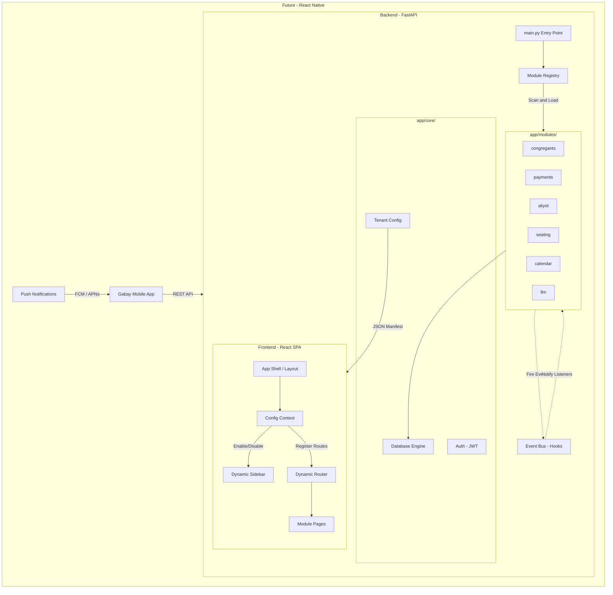

# Product Requirements Document – Gabay

## 1. Overview

**Gabay** is a synagogue management system designed for gabbaim (synagogue administrators) and community managers. The system enables management of congregants, payments, Torah aliyot, seating assignments, yahrzeits (memorial anniversaries), and joyous events — all from a single interface, in Hebrew, with full Hebrew calendar support.  
The built-in chat interface, powered by an LLM, allows the gabbai to perform any operation in natural language without navigating menus.

---

## 2. Target Audience

Gabay is a **commercial product** running on multiple synagogues. It defines four tiers of actors, each with a distinct scope of access.

```
Tier 0 – Support / Super-Admin   (Gabay product team)
Tier 1 – Admin                   (synagogue administrator / head gabbai)
Tier 2 – Gabai                   (day-to-day gabbai, 1–3 per synagogue)
Tier 3 – Congregant / Mitpalel   (WhatsApp self-service, v3.5)
```

### Support / Super-Admin (Tier 0)
- The Gabay product team. Provides remote support across all synagogue installations.
- Accesses a dedicated platform panel (`/platform`) — not the per-synagogue UI.
- Can view and edit any synagogue's `TenantConfig` for support purposes.
- Monitors LLM usage, health, audit logs, and deployment status across all tenants.
- Required before the second synagogue goes live.
- Represented by `UserRole.super_admin` in the backend.

### Admin (System Administrator / מנהל מערכת — Tier 1)
- The synagogue's primary contact: head gabbai, board chairman, or designated IT contact.
- Exactly one admin per synagogue installation.
- Bootstraps the account (first-run wizard or CLI), configures settings, and manages gabai users.
- Accesses the Settings page (`/settings`): synagogue profile, location, LLM integration, users & roles, help & support.
- Has full operational access in addition to administrative access.
- Only this persona may change `TenantConfig` fields or manage user roles within their synagogue.

### Gabai (Gabbai / גבאי — Tier 2)
- Primary day-to-day operator. A synagogue may have 1–3 gabais with equal operational permissions.
- Manages congregants, payments, aliyot, seating, yahrzeits, simchot, bulletin, prayer schedule, imports, reports, and LLM chat.
- Works in Hebrew; needs quick access during prayer services.
- Does **not** see the Settings page. Cannot manage users or change synagogue/system settings.

### Congregant (Worshipper / מתפלל — Tier 3)
- Uses WhatsApp for public information and personal self-service. No registration, app, or login `User` required.
- Identified by a verified phone number matched to their `Congregant` record.
- Can read only their own payments, aliyot, reminders, and other explicitly scoped data.
- Safe self-updates execute immediately; sensitive changes (identity, financial, yahrzeit, seating) become approval requests sent to the Gabai.

Rabbi/Cantor read-only workflows may be represented by a restricted future role; they are not a separate role in the current target model.

| Capability | super_admin | admin | gabai | congregant |
|---|---|---|---|---|
| Platform panel (all tenants) | Full | None | None | None |
| Settings page (own synagogue) | Full | Full | None | None |
| User / role management | Own account | Own synagogue | None | None |
| All operational modules | Full | Full | Full | None |
| Reports and imports | Full | Full | Full | None |
| LLM tools | All | Admin + operational | Operational | Public + `my_*` |
| Own personal data | All records | All records | All records | Self only |

---

## 3. Problem Statement

Gabbaim currently manage community records in Excel spreadsheets, handwritten notebooks, or multiple parallel files. This leads to:
- Fragmented and outdated information
- Difficulty performing quick lookups during prayer services
- No automatic reminders for yahrzeits and joyous occasions
- Manual Hebrew date calculations prone to error

---

## 4. Features – MVP

### 4.1 Congregant Management

**Description:** The central community registry.

**Capabilities:**
- Add, edit, and delete (soft delete – archive) congregants
- Fields: name, Hebrew name, father's name, mother's name, phone, email, address, gender, membership type (regular / guest / occasional), status (Kohen / Levi / Yisrael)
- Full-text search by name
- Bulk import from CSV or Google Sheets (including support for Hebrew column headers)
- Archive / restore a congregant without deleting their history

**Business Rules:**
- An archived congregant does not appear in regular searches, but their activity history is preserved
- CSV import maps columns by header name (flexible column ordering)

---

### 4.2 Hebrew Calendar

**Description:** A monthly calendar view combining Gregorian and Hebrew dates with community events.

**Capabilities:**
- Full month view with dual display: Gregorian and Hebrew
- Highlighting of Shabbat and Jewish holidays
- Bidirectional date conversion (Gregorian ↔ Hebrew)
- Calculation of "next occurrence" for a given Hebrew date (for yahrzeits and joyous events)
- Display of community events on the calendar: yahrzeits and joyous occasions scheduled for that month

**Implementation Details:**
- Implemented using the `pyluach` library on the server side
- API responses include holiday and Shabbat details for each day

---

### 4.3 Payments

**Description:** Tracking membership payments and donations.

**Capabilities:**
- Record a payment for any congregant: amount, currency, purpose, date, notes
- Payment history per congregant
- "Pending payment" list – congregants who have not yet paid for a given purpose
- Bulk delete

---

### 4.4 Torah Aliyot

**Description:** Managing the distribution of Torah aliyot per parasha.

**Capabilities:**
- Assign an aliyah to a congregant: parasha, aliyah type (First / Second / … / Maftir), date, custom, donation, notes
- View aliyot by parasha
- Aliyah history per congregant
- Bulk delete

---

### 4.5 Seating

**Description:** A seating map of the synagogue.

**Capabilities:**
- Define a seat: section, row, seat number, annual fee, assigned / unassigned
- Assign / unassign a seat to a congregant
- Filter seats by available / occupied / section
- Query: "What is congregant X's seat?"

---

### 4.6 Yahrzeits (Azkara)

**Description:** Managing yahrzeit dates for congregants' family members.

**Capabilities:**
- Add a yahrzeit: name of deceased, family relationship, Hebrew + Gregorian date, year of passing, notes
- List of upcoming yahrzeits (next X days)
- Filter by congregant

---

### 4.7 Joyous Events (Simchot)

**Description:** Managing community joyous occasions.

**Capabilities:**
- Add a simcha: type (birthday / bar mitzvah / bat mitzvah / jubilee / brit milah / wedding / other), description, Hebrew + Gregorian date, parasha, year of event, notes
- List of upcoming simchot (next X days)
- Filter by congregant / type

---

### 4.8 Hebrew LLM Interface (The Digital Gabbai)

**Description:** A Hebrew-language chat that allows the gabbai to perform any operation in natural language.

**Capabilities:**
- Questions and answers: "Who received the first aliyah for Parshat Bereishit?", "What is Avraham Cohen's balance?"
- Performing actions: "Add a payment of 500 NIS from David Levy for membership", "Assign seat A-3 to Shimon Yisrael"
- Reminders: "Who has a yahrzeit this week?"
- Mechanism: The LLM receives a Hebrew system prompt + tool list (JSON Schema); selects the relevant tool → calls the service → responds in Hebrew

**Available LLM Tools:**
| Category | Tools |
|---|---|
| Congregants | Search, add, update, archive |
| Payments | Record, view history, pending list |
| Aliyot | Assign aliyah, history by congregant / parasha |
| Seating | Query, assign, unassign |
| Yahrzeits | Add, upcoming list |
| Simchot | Add, upcoming list |
| Calendar | Date conversion, monthly view |

The effective tool list is filtered by the server-side role and scope: Admin receives administrative and operational tools, Gabai receives operational tools, and Congregant receives public and `my_*` tools only. Every tool call is re-authorized in the service/database layer.

**Failure Condition:** When the LLM cannot identify an appropriate tool — it returns an explanation in Hebrew and requests additional details.

---

## 5. Future Features (Post-MVP)

### 5.1 Prayer Schedule (v2.1) ✅
- **Rules Engine:** Instead of fixed times, the gabbai defines "Mincha = 15 min before sunset"; the system calculates automatically
- **Weekly Schedule View:** Displays weekday and Shabbat times with actual hours alongside each rule
- **Integration:** "Today's Times" dashboard card and LLM tool `get_prayer_times(date)`

### 5.2 Communications & Weekly Bulletin (v2.2 / v3.6)
- **Communication Hub:** WhatsApp send button next to yahrzeits/simchot; automatic email reminders (SMTP)
- **Dynamic Weekly Bulletin (v2.2):** Auto-generator for a formatted Shabbat announcement via WhatsApp, HTML email, and A4 printing
- **Designed Weekly Bulletin (v3.6):** Canva-style engine with Auto-Scaling to A4, theme management, and high-quality PDF/image export

### 5.3 Finance & Reports (v2.3)
- **Pledge vs. Paid:** Payment status management on every donation record
- **PDF Receipts:** Generation of formatted receipts with the synagogue's logo
- **Extended Financial Management:** Recording non-donation income and expenses (hall rental, grants)
- **Annual Report:** Export P&L (income vs. expenses) for the synagogue board

### 5.4 Advanced AI (v2.4)
- **LLM 2.0:** RAG support over PDF documents (bylaws, procedures, halachic rulings), complex queries
- **Smart Aliyah Scheduler:** Automated assignment suggestions based on frequency, yahrzeit, and Kohen/Levi/Yisrael status
- **Inventory Management:** Track books, equipment, and sacred items

### 5.5 Settings & Configuration (v2.5)

**Purpose:** Provide the Admin with a centralized, role-gated settings page for all cross-cutting configuration.

**Settings Page Tabs (Admin only):**
- **Synagogue Profile** — name, logo, brand colors (primary, secondary, background)
- **Location & Times** — city name and Geoname ID driving all prayer-time calculations; live candle-lighting preview
- **AI Assistant** — LLM provider (OpenAI / Azure / Ollama), model, API key (masked), base URL, test-connection button
- **Users** — table of gabai/admin users; invite, deactivate, change role
- **Help & Support** — app version, changelog link, documentation link, support contact

**Data Portability:**
- Export all synagogue data (congregants, payments, aliyot, seating, yahrzeits, simchot) as JSON — from the Help tab. Synagogues own their data.

**Onboarding Banner:**
- First-time admin login triggers a guided setup banner until `TenantConfig.setup_completed = true`.

**Module configuration** remains embedded inside each module — never in global Settings. This keeps Settings focused on cross-cutting concerns only.

### 5.6 Production Deployment (v3.0)
- **Security hardening:** HSTS, CSP, structured logs, rate limiting, production JWT validation
- **Docker:** Multi-stage Dockerfiles for backend and frontend; `docker-compose.yml` with health checks
- **PostgreSQL migration:** SQLite → PostgreSQL migration script with dry-run and validation
- **Cloud:** AWS ECS Fargate + RDS PostgreSQL; Secrets Manager for credentials

### 5.7 Installation & Onboarding (v3.1)

**Purpose:** Make Gabay installable and operable by a non-developer synagogue administrator.

- **`docs/INSTALLATION.md`** — step-by-step from `git clone` to first login (under 30 minutes)
- **`docs/UPGRADE.md`** — backup, pull, migrate, verify; supports zero-downtime upgrades
- **`.env.example`** — every variable documented in Hebrew with defaults and placeholders
- **`CHANGELOG.md`** — maintained with every release; linked from the in-app Help tab
- **Bootstrap CLI** — `python -m app.cli bootstrap` creates the first admin user interactively
- **First-Run Wizard** — if no admin exists in the DB, the app redirects to a guided setup: synagogue name → city → admin password → optional: invite first gabai

### 5.8 Support Platform (v3.2)

**Purpose:** Give the Gabay product team visibility and control across all installations without SSH access.

- **`/platform` route** — accessible only to `super_admin`; not visible in the per-synagogue sidebar
- **Tenant Dashboard** — all synagogue installations: name, city, version, last login, setup status
- **Remote Config** — view and edit any synagogue's `TenantConfig` for remote support
- **Audit Log** — every admin-level action logged: actor, action, entity, before/after values, timestamp
- **Module Catalog** — the authoritative list of all modules, their tier (base / addon / enterprise), and the default set for new installations. The super_admin manages this; it is the source of truth for "what comes in the box." It evolves into the license system in v4.0.

| Module | Tier | Included by default |
|---|---|---|
| congregants, payments, aliyot, seating, azkarot, smachot, calendar, auth, prayer_schedule, bulletin | base | Yes |
| llm | addon | Yes (requires external API key) |
| whatsapp (v3.5), visual_bulletin (v3.6) | addon | No |
| multi_tenant, audit_log_extended, sso | enterprise | No |

- **In-app notifications for admin:**
  - LLM key failure → red banner for the synagogue admin
  - No data export in 30 days → reminder
  - New version available → notification
- **In-app feedback:** "Report a bug" button (sidebar, visible to gabais) sends to a webhook/email; no DB required

### 5.9 Community WhatsApp Bot (v3.5)
> **Depends on v3.0** – requires JWT Auth and LLM Scope model.
- **Congregant Interface:** 24/7 self-service via WhatsApp, with no registration, app, or login `User`
- **Phone-Based Identification:** Verified phone → `Congregant` → server-enforced `congregant_id`
- **Approval Workflow:** Sensitive changes become Gabai approval requests
- **Broadcast:** Sending community-wide updates from the gabbai interface

### 5.10 Designed Weekly Bulletin (v3.6)
- **Canva-style engine** with Auto-Scaling to A4, theme management
- High-quality PDF and image (WhatsApp-ready) export

### 5.11 SaaS Platform (v4.0)
- **Multi-tenancy:** `tenant_id` on all models; subdomain routing; data isolation
- **License system:** `License` model — plan (Basic / Premium / Enterprise), expiry, permitted modules
- **Super-admin panel evolution:** Billing, module entitlement per tenant, onboarding flow for new synagogues
- **Kubernetes:** Evaluated if needed for scale; deferred until v4.0

### 5.12 Mobile Application – Android & iOS (v5.0)

**Vision:** The gabbai manages the community from the palm of his hand — anywhere, at any time.

**Recommended Approach – React Native:** single codebase, reuses 90% of existing API logic, full Hebrew RTL.

**Implementation Phases:**
1. **Phase 1 (MVP Mobile):** Dashboard, congregant search, payment recording, Push notifications
2. **Phase 2:** LLM chat, aliyot, azkarot, Hebrew calendar
3. **Phase 3:** Full offline mode, biometrics (Face ID / Fingerprint), app store publish

| Feature | Version |
|---|---|
| Rules-based prayer schedule | v2.1 ✅ |
| Communication hub + text weekly bulletin | v2.2 |
| Full financials + annual reports | v2.3 |
| Smart aliyah scheduler + inventory + LLM 2.0 | v2.4 |
| Settings page + data portability + onboarding banner | v2.5 |
| Security hardening + Docker + cloud deployment | v3.0 |
| Installation docs + first-run wizard + CHANGELOG | v3.1 |
| Support platform + audit log + in-app feedback | v3.2 |
| Community WhatsApp Bot *(requires v3.0)* | v3.5 |
| Designed weekly bulletin (Canva-style) | v3.6 |
| SaaS multi-tenancy + license system | v4.0 |
| E2E tests (Playwright) + mobile app | v5.0 |

---

## 6. Technical Architecture (Summary)

### 6.1 Architecture Overview

The system follows a **Modular Monolith** pattern — one codebase, one deployment, but each feature is a self-contained module.



### 6.2 Modular Platform Principles

Every feature is a self-contained module in `app/modules/`. The platform is designed for commercial tiering, multi-tenant SaaS, and custom deployments.

| Principle | Description |
|---|---|
| **Pluggable Architecture** | Every feature (Payments, Aliyot, etc.) lives in `app/modules/` and can be enabled or disabled independently. |
| **Dynamic Discovery** | `ModuleRegistry` loads routers and LLM tools based on the `ENABLED_MODULES` environment variable. |
| **Event-Driven Communication** | Modules communicate via an internal Hook System (Event Bus) — zero coupling between features. |
| **Soft Relationships** | Cross-module DB references use string IDs, not hard Foreign Keys, so modules can be removed without schema breakage. |
| **Tenant Manifest** | A `GET /config` endpoint provides the frontend with active modules and per-synagogue branding. |

### 6.2 Technology Stack

| Layer | Technology |
|---|---|
| Backend | Python 3.11+, FastAPI, Uvicorn |
| ORM / DB | SQLModel + SQLite (switchable to PostgreSQL) |
| Hebrew Calendar | pyluach |
| LLM | OpenAI API (flexible: Azure / Ollama) |
| Frontend | React 19, TypeScript, Vite, Tailwind CSS |
| State Management | TanStack Query (React Query) |
| Routing | React Router 7 |

---

## 7. Success Metrics (MVP)

| Metric | Target |
|---|---|
| Time to add a new congregant | Less than 60 seconds |
| Time to find an upcoming yahrzeit | Less than 10 seconds |
| Chat query to response | Less than 5 seconds |
| Import 100 congregants from CSV | Less than 30 seconds |

---

## 8. Open Issues

1. **Currencies:** Is multi-currency support needed (USD/EUR in addition to NIS)? The field is currently flexible.
2. **Data Backup:** The data-portability export (v2.5) covers manual export. Automated backup documentation and restore testing are v3.1 items.
3. **Authentication and Authorization:** Fully implemented as of v3.0 — JWT, refresh tokens, `admin`/`gabai`/`congregant` roles, and scoped LLM enforcement. `super_admin` role added in v2.5.
4. **Demo / Sandbox Mode:** Should prospective synagogues be able to try Gabay with pre-seeded data before installing? Not planned yet — evaluate before v4.0 SaaS launch.
5. **Terms of Service / Privacy Policy:** Required before publicly marketing the product. Not a technical item; must be authored and linked from the login page and Help tab.
6. **Email Notifications:** SMTP for yahrzeit reminders is deferred (v2.2 partial). Should the admin be able to configure SMTP from the Settings page? Evaluate in v2.5 scope.
7. **Multi-language UI:** Currently Hebrew-only. Future: English admin panel for non-Hebrew-speaking support staff?

