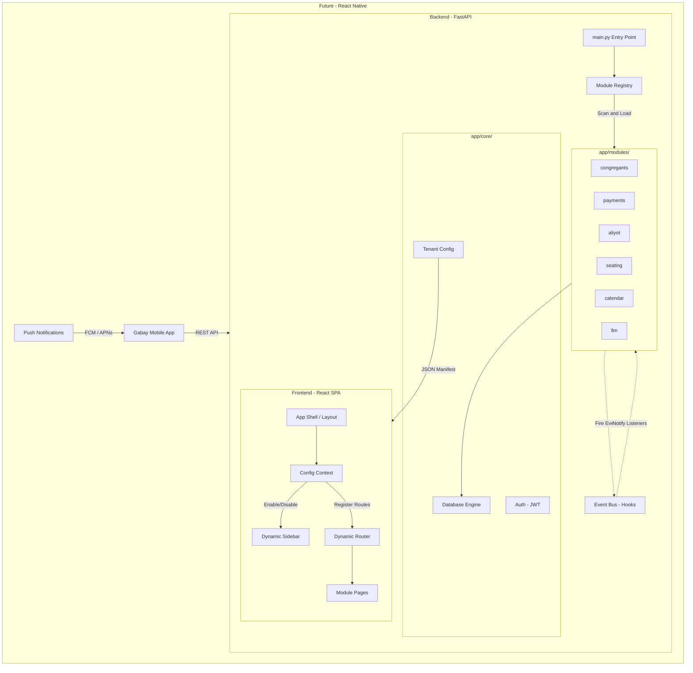

# Product Requirements Document – Gabay

## 1. Overview

**Gabay** is a synagogue management system designed for gabbaim (synagogue administrators) and community managers. The system enables management of congregants, payments, Torah aliyot, seating assignments, yahrzeits (memorial anniversaries), and joyous events — all from a single interface, in Hebrew, with full Hebrew calendar support.  
The built-in chat interface, powered by an LLM, allows the gabbai to perform any operation in natural language without navigating menus.

---

## 2. Target Audience

### Admin (System Administrator / מנהל מערכת)
- Bootstraps the synagogue account and manages web users and role assignments
- Configures Synagogue settings (`TenantConfig`), enabled modules, integrations, and security
- Has emergency operational access, but routine synagogue work is normally delegated to a Gabai
- Only this persona may change protected synagogue/system settings

### Gabai (Gabbai / גבאי)
- Primary day-to-day operator: head gabbai, deputy, or an authorized finance/community manager
- Manages congregants, payments, aliyot, seating, yahrzeits, simchot, imports, reports, communications, and operational LLM tools
- Works in Hebrew and needs quick access during prayer services
- Cannot manage users or roles and cannot change protected synagogue/system settings

### Congregant (Worshipper / מתפלל)
- Uses WhatsApp for public information and personal self-service; no registration, app, or login `User` is required
- Is identified by a verified phone number matched to their `Congregant` record
- Can read only their own payments, aliyot, reminders, and other explicitly scoped data
- May make safe self-updates immediately; sensitive identity, financial, yahrzeit, seating, or permission changes become requests requiring Gabai approval

Rabbi/Cantor read-only workflows may be represented by a suitably restricted future role; they are not a separate role in the current three-role target.

This persona model is implemented in the backend role enum. Operational APIs allow `admin` and `gabai`; user administration and protected settings remain `admin`-only.

---

## 3. Problem Statement

Gabbaim currently manage community records in Excel spreadsheets, handwritten notebooks, or multiple parallel files. This leads to:
- Fragmented and outdated information
- Difficulty performing quick lookups during prayer services
- No automatic reminders for yahrzeits and joyous occasions
- Manual Hebrew date calculations prone to error

---

## 4. Features – MVP

### 4.1 Congregant Management

**Description:** The central community registry.

**Capabilities:**
- Add, edit, and delete (soft delete – archive) congregants
- Fields: name, Hebrew name, father's name, mother's name, phone, email, address, gender, membership type (regular / guest / occasional), status (Kohen / Levi / Yisrael)
- Full-text search by name
- Bulk import from CSV or Google Sheets (including support for Hebrew column headers)
- Archive / restore a congregant without deleting their history

**Business Rules:**
- An archived congregant does not appear in regular searches, but their activity history is preserved
- CSV import maps columns by header name (flexible column ordering)

---

### 4.2 Hebrew Calendar

**Description:** A monthly calendar view combining Gregorian and Hebrew dates with community events.

**Capabilities:**
- Full month view with dual display: Gregorian and Hebrew
- Highlighting of Shabbat and Jewish holidays
- Bidirectional date conversion (Gregorian ↔ Hebrew)
- Calculation of "next occurrence" for a given Hebrew date (for yahrzeits and joyous events)
- Display of community events on the calendar: yahrzeits and joyous occasions scheduled for that month

**Implementation Details:**
- Implemented using the `pyluach` library on the server side
- API responses include holiday and Shabbat details for each day

---

### 4.3 Payments

**Description:** Tracking membership payments and donations.

**Capabilities:**
- Record a payment for any congregant: amount, currency, purpose, date, notes
- Payment history per congregant
- "Pending payment" list – congregants who have not yet paid for a given purpose
- Bulk delete

---

### 4.4 Torah Aliyot

**Description:** Managing the distribution of Torah aliyot per parasha.

**Capabilities:**
- Assign an aliyah to a congregant: parasha, aliyah type (First / Second / … / Maftir), date, custom, donation, notes
- View aliyot by parasha
- Aliyah history per congregant
- Bulk delete

---

### 4.5 Seating

**Description:** A seating map of the synagogue.

**Capabilities:**
- Define a seat: section, row, seat number, annual fee, assigned / unassigned
- Assign / unassign a seat to a congregant
- Filter seats by available / occupied / section
- Query: "What is congregant X's seat?"

---

### 4.6 Yahrzeits (Azkara)

**Description:** Managing yahrzeit dates for congregants' family members.

**Capabilities:**
- Add a yahrzeit: name of deceased, family relationship, Hebrew + Gregorian date, year of passing, notes
- List of upcoming yahrzeits (next X days)
- Filter by congregant

---

### 4.7 Joyous Events (Simchot)

**Description:** Managing community joyous occasions.

**Capabilities:**
- Add a simcha: type (birthday / bar mitzvah / bat mitzvah / jubilee / brit milah / wedding / other), description, Hebrew + Gregorian date, parasha, year of event, notes
- List of upcoming simchot (next X days)
- Filter by congregant / type

---

### 4.8 Hebrew LLM Interface (The Digital Gabbai)

**Description:** A Hebrew-language chat that allows the gabbai to perform any operation in natural language.

**Capabilities:**
- Questions and answers: "Who received the first aliyah for Parshat Bereishit?", "What is Avraham Cohen's balance?"
- Performing actions: "Add a payment of 500 NIS from David Levy for membership", "Assign seat A-3 to Shimon Yisrael"
- Reminders: "Who has a yahrzeit this week?"
- Mechanism: The LLM receives a Hebrew system prompt + tool list (JSON Schema); selects the relevant tool → calls the service → responds in Hebrew

**Available LLM Tools:**
| Category | Tools |
|---|---|
| Congregants | Search, add, update, archive |
| Payments | Record, view history, pending list |
| Aliyot | Assign aliyah, history by congregant / parasha |
| Seating | Query, assign, unassign |
| Yahrzeits | Add, upcoming list |
| Simchot | Add, upcoming list |
| Calendar | Date conversion, monthly view |

The effective tool list is filtered by the server-side role and scope: Admin receives administrative and operational tools, Gabai receives operational tools, and Congregant receives public and `my_*` tools only. Every tool call is re-authorized in the service/database layer.

**Failure Condition:** When the LLM cannot identify an appropriate tool — it returns an explanation in Hebrew and requests additional details.

---

## 5. Future Features (Post-MVP)

### 5.1 Prayer Schedule (v2.1)
- **Rules Engine:** Instead of fixed times, the gabbai defines "Mincha = 15 min before sunset"; the system calculates automatically
- **Weekly Schedule View:** Displays weekday and Shabbat times with actual hours alongside each rule
- **Integration:** "Today's Times" dashboard card and LLM tool `get_prayer_times(date)`

### 5.2 Communications & Weekly Bulletin (v2.2 / v3.6)
- **Communication Hub:** WhatsApp send button next to yahrzeits/simchot; automatic email reminders (SMTP)
- **Dynamic Weekly Bulletin (v2.2):** Auto-generator for a formatted Shabbat announcement via WhatsApp, HTML email, and A4 printing
- **Designed Weekly Bulletin (v3.6):** Canva-style engine with Auto-Scaling to A4, theme management, and high-quality PDF/image export

### 5.3 Finance & Reports (v2.3)
- **Pledge vs. Paid:** Payment status management on every donation record
- **PDF Receipts:** Generation of formatted receipts with the synagogue's logo
- **Extended Financial Management (v2.3):** Recording non-donation income and expenses (hall rental, grants)
- **Annual Report:** Export P&L (income vs. expenses) for the synagogue board

### 5.4 Advanced AI (v2.4)
- **LLM 2.0:** RAG support over PDF documents (bylaws, procedures, halachic rulings), complex queries
- **Smart Aliyah Scheduler:** Automated assignment suggestions based on frequency, yahrzeit, and Kohen/Levi/Yisrael status
- **Inventory Management:** Track books, equipment, and sacred items

### 5.5 Community WhatsApp Bot (v3.5)
> **Depends on v3.0** – requires JWT Auth and LLM Scope model before development.
- **Congregant Interface:** 24/7 self-service via WhatsApp, with no registration, app, or login `User`
- **Phone-Based Identification:** Verified phone → `Congregant` → server-enforced `congregant_id`; unknown or ambiguous senders receive no private data
- **Immediate Actions:** Public reads, personal reads, and explicitly safe self-updates
- **Approval Workflow:** Sensitive identity, financial, yahrzeit, seating, or permission changes are sent to a Gabai for approval
- **Auditability:** Identity resolution, scope, tools, changes, approvals, and outcomes are logged
- **Broadcast:** Sending community-wide updates from the gabbai interface

### 5.6 Platform Architecture (v4.0)
- **Module Registry:** Enable/disable modules per synagogue's needs (`.env`)
- **Hook System:** Custom logic injection points without modifying the core
- **Tenant Config:** Dynamic theming (colors, logo) per synagogue
- **Multi-tenancy:** Data isolation for SaaS deployments with multiple synagogues

### 5.7 Mobile Application – Android & iOS (v5.0)

**Vision:** The gabbai manages the community from the palm of his hand — anywhere, at any time, including during prayer services.

**Recommended Approach – React Native:**
- Reuses 90% of existing logic and the current API layer
- Single codebase for both platforms (Android + iOS)
- Full Hebrew RTL interface with Hebrew calendar support

**Key Mobile Features:**
- Dashboard with community statistics
- Quick congregant search and profile view
- One-tap payment and aliyah recording
- Push notifications for upcoming yahrzeits and simchot (D-7, D-1)
- Access to the Digital Gabbai chat (LLM)
- Basic offline mode — read from local cache when disconnected

**Implementation Phases:**
1. **Phase 1 (MVP Mobile):** Dashboard, congregant search, payment recording, Push notifications
2. **Phase 2:** LLM chat, aliyot, azkarot, Hebrew calendar
3. **Phase 3:** Full offline mode, biometrics (Face ID / Fingerprint)

| Feature | Version |
|---|---|
| Rules-based prayer schedule | v2.1 |
| Communication hub + text weekly bulletin | v2.2 |
| Full financials + annual reports | v2.3 |
| Smart aliyah scheduler + inventory + LLM 2.0 | v2.4 |
| User auth (JWT) + production deployment | v3.0 |
| Community WhatsApp Bot *(requires v3.0)* | v3.5 |
| Designed weekly bulletin (Canva-style) | v3.6 |
| Platform architecture (SaaS) | v4.0 |
| E2E tests (Playwright) + mobile app | v5.0 |

---

## 6. Technical Architecture (Summary)

### 6.1 Architecture Overview

The system follows a **Modular Monolith** pattern — one codebase, one deployment, but each feature is a self-contained module.

### 6.2 Modular Platform Principles

Every feature is a self-contained module in `app/modules/`. The platform is designed for commercial tiering, multi-tenant SaaS, and custom deployments.

| Principle | Description |
|---|---|
| **Pluggable Architecture** | Every feature (Payments, Aliyot, etc.) lives in `app/modules/` and can be enabled or disabled independently. |
| **Dynamic Discovery** | `ModuleRegistry` loads routers and LLM tools based on the `ENABLED_MODULES` environment variable. |
| **Event-Driven Communication** | Modules communicate via an internal Hook System (Event Bus) — zero coupling between features. |
| **Soft Relationships** | Cross-module DB references use string IDs, not hard Foreign Keys, so modules can be removed without schema breakage. |
| **Tenant Manifest** | A `GET /config` endpoint provides the frontend with active modules and per-synagogue branding. |

### 6.2 Technology Stack

| Layer | Technology |
|---|---|
| Backend | Python 3.11+, FastAPI, Uvicorn |
| ORM / DB | SQLModel + SQLite (switchable to PostgreSQL) |
| Hebrew Calendar | pyluach |
| LLM | OpenAI API (flexible: Azure / Ollama) |
| Frontend | React 19, TypeScript, Vite, Tailwind CSS |
| State Management | TanStack Query (React Query) |
| Routing | React Router 7 |

---

## 7. Success Metrics (MVP)

| Metric | Target |
|---|---|
| Time to add a new congregant | Less than 60 seconds |
| Time to find an upcoming yahrzeit | Less than 10 seconds |
| Chat query to response | Less than 5 seconds |
| Import 100 congregants from CSV | Less than 30 seconds |

---

## 8. Open Issues

1. **Currencies:** Is multi-currency support needed (USD/EUR in addition to NIS)? The field is currently flexible.
2. **Data Backup:** Planned for v3.0 – a CSV export endpoint and manual backup documentation for `gabay.db`.
3. **Authentication and Authorization:** Backend JWT/session foundations are implemented. Route/service protection, the `gabai` role, frontend login, role-specific UI, and scoped LLM/WhatsApp enforcement remain v3.0 work and are prerequisites for the WhatsApp Bot (v3.5).
4. **UI Language:** The interface has been fully localized to Hebrew (RTL) – all headings, buttons, and menus are in Hebrew.

