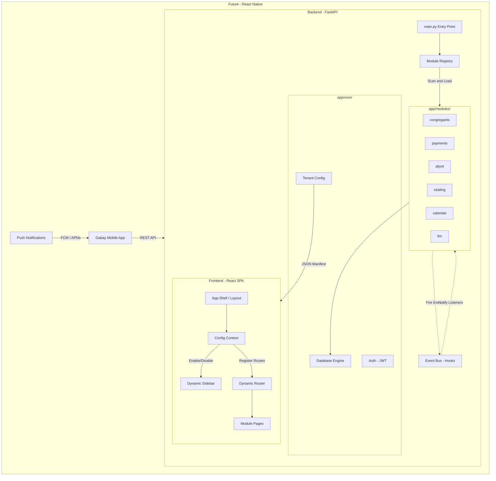

# Product Requirements Document – Gabay

## 1. Overview

**Gabay** is a synagogue management system designed for gabbaim (synagogue administrators) and community managers. The system enables management of congregants, payments, Torah aliyot, seating assignments, yahrzeits (memorial anniversaries), and joyous events — all from a single interface, in Hebrew, with full Hebrew calendar support.  
The built-in chat interface, powered by an LLM, allows the gabbai to perform any operation in natural language without navigating menus.

---

## 2. Target Audience

### Primary User – The Gabbai
- Day-to-day administrator of the synagogue: head gabbai or deputy
- Typically has basic to intermediate technical proficiency
- Works in Hebrew; well-versed in the Hebrew calendar and synagogue terminology
- Requires quick access to information during prayer services (who attended, who receives an aliyah, who has a yahrzeit)

### Secondary Users
- **Community Finance Manager** – tracking payments and donations
- **Rabbi / Cantor** – reviewing Torah aliyot and yahrzeits for the weekly portion

---

## 3. Problem Statement

Gabbaim currently manage community records in Excel spreadsheets, handwritten notebooks, or multiple parallel files. This leads to:
- Fragmented and outdated information
- Difficulty performing quick lookups during prayer services
- No automatic reminders for yahrzeits and joyous occasions
- Manual Hebrew date calculations prone to error

---

## 4. Features – MVP

### 4.1 Congregant Management

**Description:** The central community registry.

**Capabilities:**
- Add, edit, and delete (soft delete – archive) congregants
- Fields: name, Hebrew name, father's name, mother's name, phone, email, address, gender, membership type (regular / guest / occasional), status (Kohen / Levi / Yisrael)
- Full-text search by name
- Bulk import from CSV or Google Sheets (including support for Hebrew column headers)
- Archive / restore a congregant without deleting their history

**Business Rules:**
- An archived congregant does not appear in regular searches, but their activity history is preserved
- CSV import maps columns by header name (flexible column ordering)

---

### 4.2 Hebrew Calendar

**Description:** A monthly calendar view combining Gregorian and Hebrew dates with community events.

**Capabilities:**
- Full month view with dual display: Gregorian and Hebrew
- Highlighting of Shabbat and Jewish holidays
- Bidirectional date conversion (Gregorian ↔ Hebrew)
- Calculation of "next occurrence" for a given Hebrew date (for yahrzeits and joyous events)
- Display of community events on the calendar: yahrzeits and joyous occasions scheduled for that month

**Implementation Details:**
- Implemented using the `pyluach` library on the server side
- API responses include holiday and Shabbat details for each day

---

### 4.3 Payments

**Description:** Tracking membership payments and donations.

**Capabilities:**
- Record a payment for any congregant: amount, currency, purpose, date, notes
- Payment history per congregant
- "Pending payment" list – congregants who have not yet paid for a given purpose
- Bulk delete

---

### 4.4 Torah Aliyot

**Description:** Managing the distribution of Torah aliyot per parasha.

**Capabilities:**
- Assign an aliyah to a congregant: parasha, aliyah type (First / Second / … / Maftir), date, custom, donation, notes
- View aliyot by parasha
- Aliyah history per congregant
- Bulk delete

---

### 4.5 Seating

**Description:** A seating map of the synagogue.

**Capabilities:**
- Define a seat: section, row, seat number, annual fee, assigned / unassigned
- Assign / unassign a seat to a congregant
- Filter seats by available / occupied / section
- Query: "What is congregant X's seat?"

---

### 4.6 Yahrzeits (Azkara)

**Description:** Managing yahrzeit dates for congregants' family members.

**Capabilities:**
- Add a yahrzeit: name of deceased, family relationship, Hebrew + Gregorian date, year of passing, notes
- List of upcoming yahrzeits (next X days)
- Filter by congregant

---

### 4.7 Joyous Events (Simchot)

**Description:** Managing community joyous occasions.

**Capabilities:**
- Add a simcha: type (birthday / bar mitzvah / bat mitzvah / jubilee / brit milah / wedding / other), description, Hebrew + Gregorian date, parasha, year of event, notes
- List of upcoming simchot (next X days)
- Filter by congregant / type

---

### 4.8 Hebrew LLM Interface (The Digital Gabbai)

**Description:** A Hebrew-language chat that allows the gabbai to perform any operation in natural language.

**Capabilities:**
- Questions and answers: "Who received the first aliyah for Parshat Bereishit?", "What is Avraham Cohen's balance?"
- Performing actions: "Add a payment of 500 NIS from David Levy for membership", "Assign seat A-3 to Shimon Yisrael"
- Reminders: "Who has a yahrzeit this week?"
- Mechanism: The LLM receives a Hebrew system prompt + tool list (JSON Schema); selects the relevant tool → calls the service → responds in Hebrew

**Available LLM Tools:**
| Category | Tools |
|---|---|
| Congregants | Search, add, update, archive |
| Payments | Record, view history, pending list |
| Aliyot | Assign aliyah, history by congregant / parasha |
| Seating | Query, assign, unassign |
| Yahrzeits | Add, upcoming list |
| Simchot | Add, upcoming list |
| Calendar | Date conversion, monthly view |

**Failure Condition:** When the LLM cannot identify an appropriate tool — it returns an explanation in Hebrew and requests additional details.

---

## 5. Future Features (Post-MVP)

### 5.1 Communications & Weekly Bulletin
- **Communication Hub:** Sending automatic WhatsApp and email reminders for yahrzeits and simchot
- **Dynamic Weekly Bulletin (2.5):** Auto-generator for a formatted Shabbat announcement via WhatsApp, email (Google Groups), and basic printing
- **Designed Weekly Bulletin (2.9):** Canva-style design engine with Auto-Scaling to A4, theme management, and high-quality PDF/image export

### 5.2 Finance & Reports
- **Extended Financial Management (2.7):** Recording non-donation income and expenses (hall rental, grants)
- **Annual Report:** Export P&L (income vs. expenses) for the synagogue board
- **PDF Receipts:** Generation of formatted receipts with the synagogue's logo

### 5.3 Advanced AI
- **LLM 2.0 (2.5):** RAG support over PDF documents (bylaws, procedures, halachic rulings), complex queries
- **Smart Aliyah Scheduler (2.8):** Automated assignment suggestions based on frequency, yahrzeit, and Kohen/Levi/Yisrael status
- **Rules-Based Prayer Timetable (2.6):** Automatic prayer time calculation relative to sunset/sunrise

### 5.4 Community WhatsApp Bot (3.5)
- **Congregant Interface:** 24/7 self-service for congregants via WhatsApp (no registration, no app required)
- **Phone-Based Identification:** Congregant is identified by their phone number; the restricted LLM only sees their personal data
- **Broadcast:** Sending community-wide updates from the gabbai interface

### 5.5 Platform Architecture (4)
- **Module Registry:** Enable/disable modules per synagogue's needs (`.env`)
- **Hook System:** Custom logic injection points without modifying the core
- **Tenant Config:** Dynamic theming (colors, logo) per synagogue
- **Multi-tenancy:** Data isolation for SaaS deployments with multiple synagogues

### 5.6 Mobile Application – Android & iOS (Milestone 6)

**Vision:** The gabbai manages the community from the palm of his hand — anywhere, at any time, including during prayer services.

**Recommended Approach – React Native:**
- Reuses 90% of existing logic and the current API layer
- Single codebase for both platforms (Android + iOS)
- Full Hebrew RTL interface with Hebrew calendar support

**Key Mobile Features:**
- Dashboard with community statistics
- Quick congregant search and profile view
- One-tap payment and aliyah recording
- Push notifications for upcoming yahrzeits and simchot (D-7, D-1)
- Access to the Digital Gabbai chat (LLM)
- Basic offline mode — read from local cache when disconnected

**Implementation Phases:**
1. **Phase 1 (MVP Mobile):** Dashboard, congregant search, payment recording, Push notifications
2. **Phase 2:** LLM chat, aliyot, azkarot, Hebrew calendar
3. **Phase 3:** Full offline mode, biometrics (Face ID / Fingerprint)

| Feature | Status |
|---|---|
| User Management / Permissions (JWT) | Milestone 3 |
| Dynamic Weekly Bulletin | Milestone 2.5 |
| Designed Weekly Bulletin (Canva-style) | Milestone 2.9 |
| Financial Management & Annual Reports | Milestone 2.7 |
| Smart Aliyah Scheduler + Inventory | Milestone 2.8 |
| Community WhatsApp Bot | Milestone 3.5 |
| Platform Architecture (SaaS) | Milestone 4 |
| E2E Tests (Playwright) | Milestone 5 |
| Mobile Application (Android + iOS) | Milestone 6 |

---

## 6. Technical Architecture (Summary)

### 6.1 Architecture Overview

The system follows a **Modular Monolith** pattern — one codebase, one deployment, but each feature is a self-contained module.

### 6.2 Modular Platform Principles

Every feature is a self-contained module in `app/modules/`. The platform is designed for commercial tiering, multi-tenant SaaS, and custom deployments.

| Principle | Description |
|---|---|
| **Pluggable Architecture** | Every feature (Payments, Aliyot, etc.) lives in `app/modules/` and can be enabled or disabled independently. |
| **Dynamic Discovery** | `ModuleRegistry` loads routers and LLM tools based on the `ENABLED_MODULES` environment variable. |
| **Event-Driven Communication** | Modules communicate via an internal Hook System (Event Bus) — zero coupling between features. |
| **Soft Relationships** | Cross-module DB references use string IDs, not hard Foreign Keys, so modules can be removed without schema breakage. |
| **Tenant Manifest** | A `GET /config` endpoint provides the frontend with active modules and per-synagogue branding. |

### 6.2 Technology Stack

| Layer | Technology |
|---|---|
| Backend | Python 3.11+, FastAPI, Uvicorn |
| ORM / DB | SQLModel + SQLite (switchable to PostgreSQL) |
| Hebrew Calendar | pyluach |
| LLM | OpenAI API (flexible: Azure / Ollama) |
| Frontend | React 19, TypeScript, Vite, Tailwind CSS |
| State Management | TanStack Query (React Query) |
| Routing | React Router 7 |

---

## 7. Success Metrics (MVP)

| Metric | Target |
|---|---|
| Time to add a new congregant | Less than 60 seconds |
| Time to find an upcoming yahrzeit | Less than 10 seconds |
| Chat query to response | Less than 5 seconds |
| Import 100 congregants from CSV | Less than 30 seconds |

---

## 8. Open Issues

1. **Currencies:** Is multi-currency support needed (USD/EUR in addition to NIS)? The field is currently flexible.
2. **Data Backup:** Planned for Milestone 3 – a CSV export endpoint and manual backup documentation for `gabay.db`.
3. **Authentication:** Planned for Milestone 3 – full JWT + Login page implementation.
4. **UI Language:** The interface has been fully localized to Hebrew (RTL) – all headings, buttons, and menus are in Hebrew.

